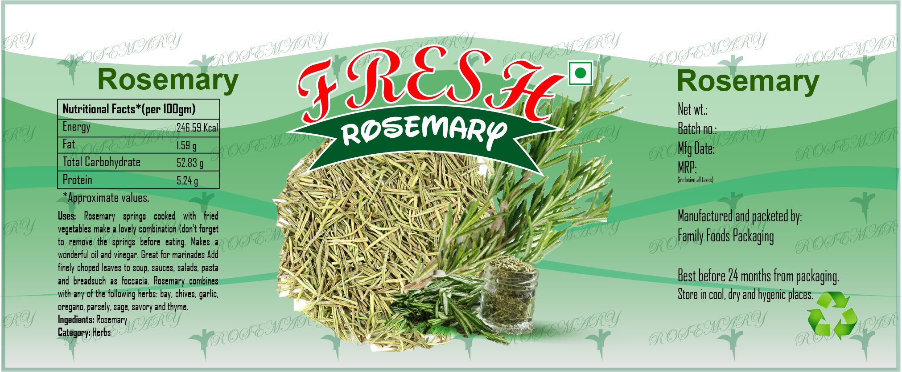
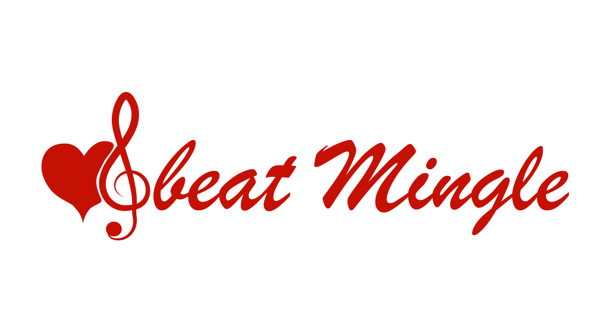
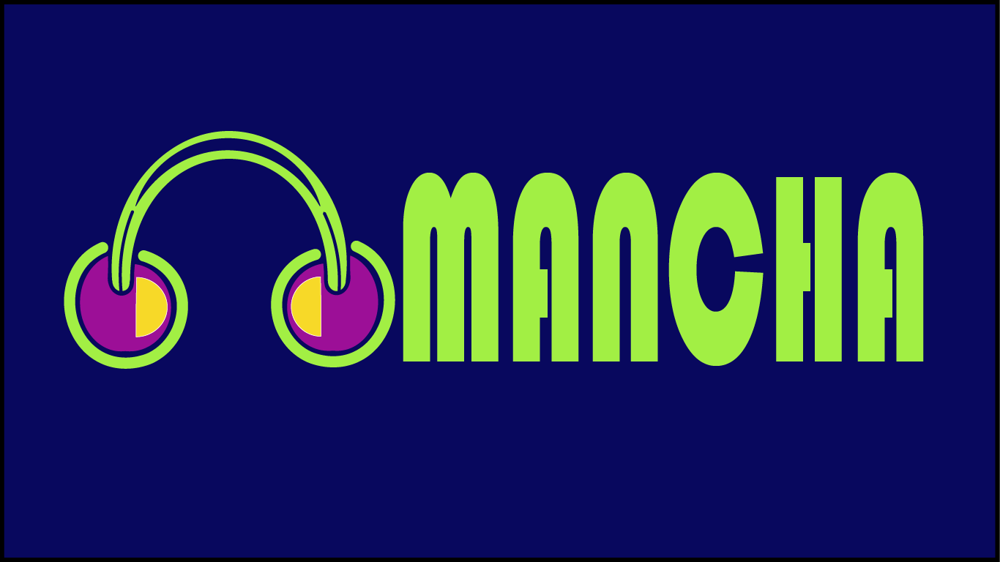
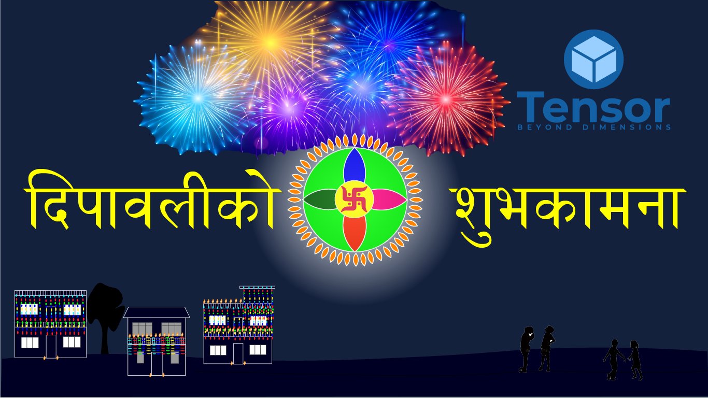
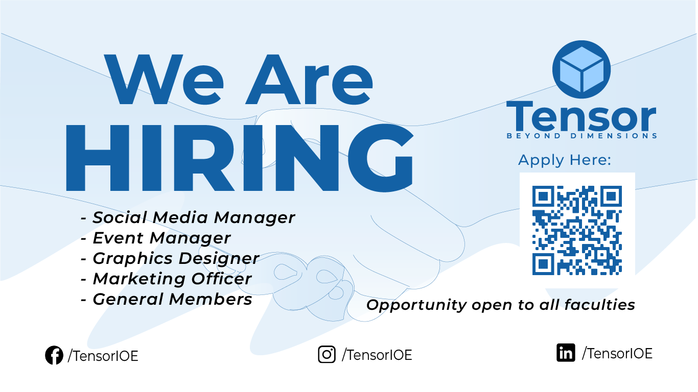
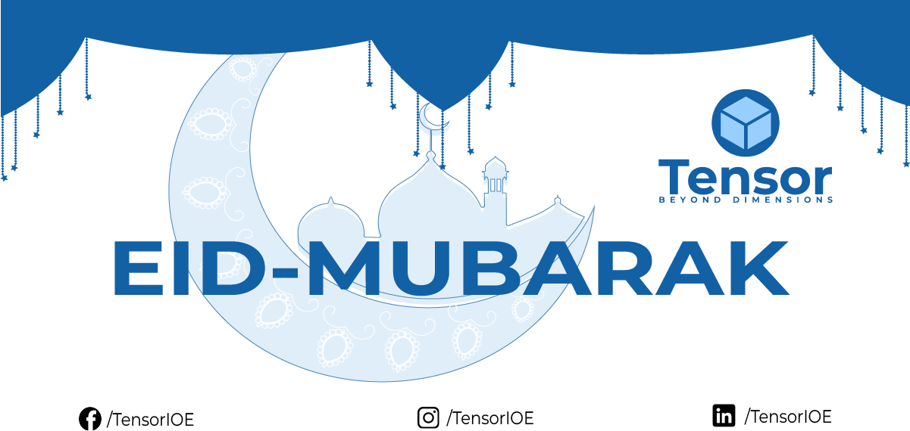
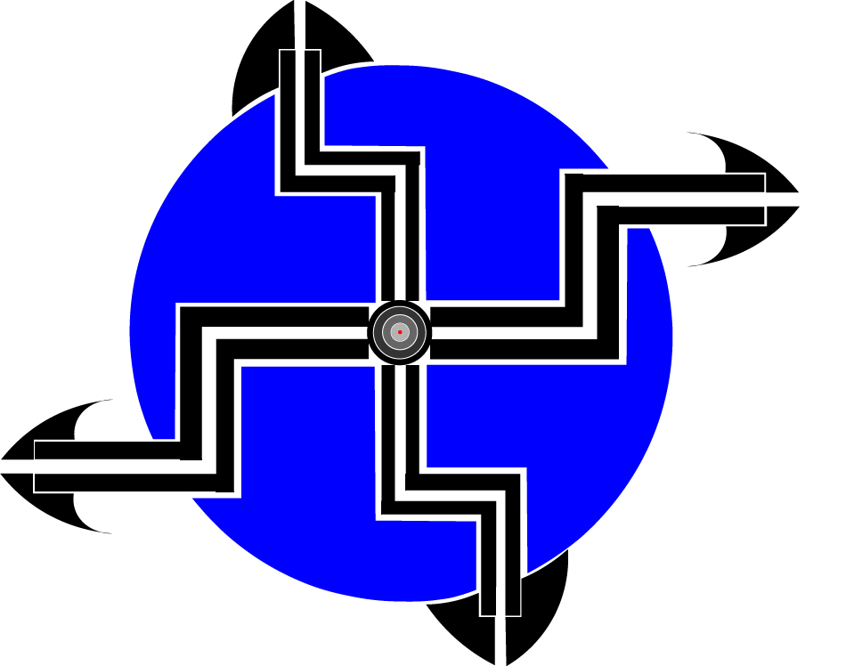

# GRAPHIC-DESIGNS
This repository  consists of all the graphic designs that I've made to date to showcase my whole journey in graphic design. The works I've done in order(most recent at the top):

CC-Ratio

 

Brandspire

 

Kikkoman Soy Sauce

 

Eagle Yeast

 

Fresh Rosemary

 

Fresh Oregano

 

beat Mingle

 

MANCHA

 

Cricmandu

 

Purple Rain

 

Dipawali

 

Hawaiijahaj

 

Hiring

 

Guru Purnima

 

Eid Mubarak

 

Lost Under The Night Sky

 

Tensor logo(I know it's bad)

 

 

Talking Cricket Version-2

 

Talking Cricket

 

First Sight

 

